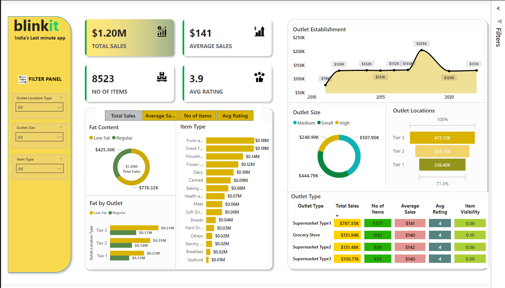

# Blinkit Sales Performance Analysis

## Project Overview
This project involves a comprehensive analysis of Blinkit’s sales and outlet performance data using Power BI. The goal is to extract valuable insights and answer key business questions based on the dataset. The following README.md provides a detailed account of the project's objectives, business problems, solutions, findings, and more.

## Objectives
- Analyze overall sales performance, including total sales, average sales, and the number of items sold.
- Understand outlet characteristics, such as size, location type (Tier 1, 2, 3), and establishment trends over time.
- Examine product category performance and assess attributes like fat content and item type contributions to sales.
- Provide stakeholders with dynamic filtering capabilities for better segmentation and insights.
- Deliver actionable insights to optimize outlet operations, product visibility, and customer satisfaction.

## Business Problem
Blinkit faces challenges in the fast-paced retail market:
1. Identifying high-performing outlets and understanding factors driving their success.
2. Gaining insights into customer preferences and their impact on product sales.
3. Optimizing product distribution across outlets based on outlet size and type.
4. Improving strategic decision-making to enhance profitability and customer experience.

## Solution
By utilizing Power BI for data visualization and analysis, the project addresses these challenges through:
1. Comprehensive dashboards that provide key metrics and visual insights into sales and outlet performance.
2. Dynamic filtering options for granular analysis by outlet location type, size, and product type.
3. Visual representation of trends, including outlet establishment over time and product performance by category.
4. Data-driven recommendations for improving operational efficiency and customer engagement.

## Findings
- Tier 3 outlets contribute the highest total sales, followed by Tier 2 and Tier 1.
- Products with **Regular Fat Content** outperform those with **Low Fat Content** in total sales.
- Certain product categories, like Fruits & Vegetables and Snack Foods, generate the highest revenue.
- Larger outlet sizes consistently perform better in terms of total sales and average sales.

## Conclusion
The analysis provides actionable insights into sales patterns, outlet efficiency, and product performance, helping stakeholders optimize business strategies for better outcomes.

